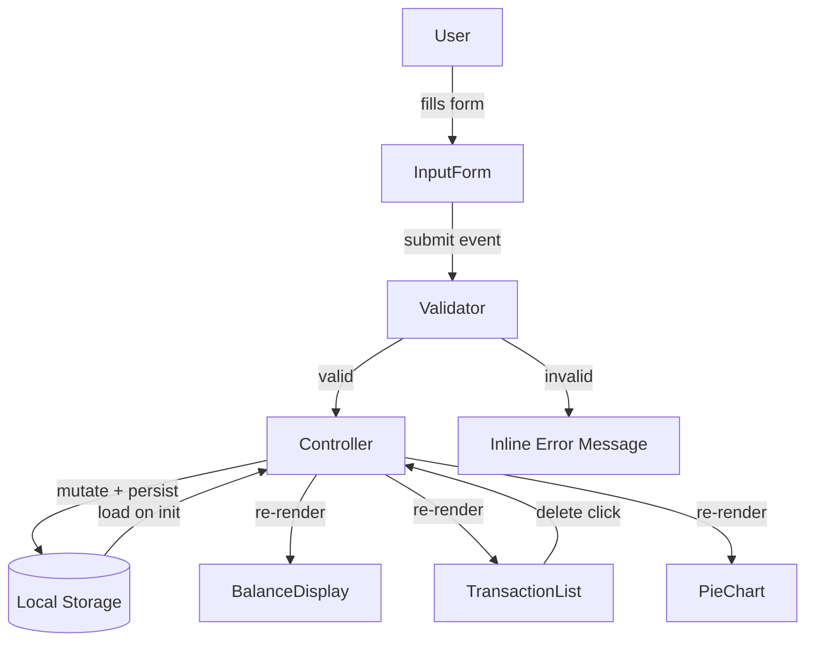

# Design Document: Expense & Budget Visualizer

## Overview

The Expense & Budget Visualizer is a single-page, client-side web application built with plain HTML, CSS, and Vanilla JavaScript. It allows users to record daily spending transactions, view a running total balance, browse a scrollable transaction history, and see a pie chart of spending by category. All data is persisted in the browser's Local Storage — no server, no build step, no framework.

Chart.js is loaded via CDN to render the pie chart. The entire app ships as a single `index.html` with one stylesheet (`css/style.css`) and one script (`js/app.js`).

---

## Architecture

The app follows a simple **MVC-lite** pattern entirely within a single JS file:

- **Model** — the in-memory transaction array and all Local Storage read/write operations.
- **View** — pure functions that re-render the Transaction List, Balance Display, and Chart from the current model state.
- **Controller** — event listeners on the form and transaction list that mutate the model then call the view functions.

Because there is no framework, state is held in a module-level `transactions` array. Every mutation (add / delete) immediately persists to Local Storage and triggers a full re-render of all three view components. This keeps the data flow simple and predictable.



---

## Components and Interfaces

### Input Form (`renderForm` / form event listener)

Responsible for collecting user input and delegating to the validator.

```
Fields:
  itemName  : <input type="text">
  amount    : <input type="number" min="0.01" step="0.01">
  category  : <select> with options Food | Transport | Fun

Events:
  submit → validate() → addTransaction(itemName, amount, category)

Error display:
  Inline <span> elements beneath each field, toggled by the validator.
```

### Validator (`validate(formData) → ValidationResult`)

Pure function — no side effects.

```
Input:  { itemName: string, amount: string, category: string }
Output: { valid: boolean, errors: { itemName?: string, amount?: string, category?: string } }

Rules:
  itemName  : must be non-empty after trimming whitespace
  amount    : must parse to a finite number > 0
  category  : must be one of ["Food", "Transport", "Fun"]
```

### Model / Storage (`loadTransactions`, `saveTransactions`, `addTransaction`, `deleteTransaction`)

```
Transaction shape:
  { id: string, itemName: string, amount: number, category: string, createdAt: number }

loadTransactions() → Transaction[]
  Reads "transactions" key from localStorage.
  On parse error or absence → returns [].

saveTransactions(transactions: Transaction[]) → void
  JSON.stringify and writes to localStorage["transactions"].

addTransaction(itemName, amount, category) → Transaction
  Creates a new Transaction with a generated id and current timestamp.
  Pushes to in-memory array, calls saveTransactions.

deleteTransaction(id: string) → void
  Filters in-memory array, calls saveTransactions.
```

### Balance Display (`renderBalance(transactions)`)

```
Input:  Transaction[]
Output: DOM mutation — sets text content of #balance element

Logic:  sum = transactions.reduce((acc, t) => acc + t.amount, 0)
        formatted as currency string (e.g. "$123.45")
```

### Transaction List (`renderList(transactions)`)

```
Input:  Transaction[]
Output: DOM mutation — replaces children of #transaction-list

Ordering: reverse-chronological (sort by createdAt descending)
Each row:  item name | formatted amount | category | delete button
Empty state: single <li> with "No transactions recorded."
```

### Pie Chart (`renderChart(transactions)`)

```
Input:  Transaction[]
Output: Chart.js pie chart rendered on <canvas id="chart">

Logic:
  1. Group transactions by category, sum amounts per group.
  2. Exclude categories with zero total.
  3. Pass labels + data arrays to Chart.js.
  4. Destroy previous chart instance before creating a new one
     (stored in module-level `chartInstance` variable).

Colors:
  Food      → #FF6384
  Transport → #36A2EB
  Fun       → #FFCE56
```

---

## Data Models

### Transaction

```js
{
  id:        string,   // crypto.randomUUID() or Date.now().toString()
  itemName:  string,   // non-empty, user-supplied
  amount:    number,   // positive float, e.g. 12.50
  category:  string,   // "Food" | "Transport" | "Fun"
  createdAt: number    // Unix timestamp ms, Date.now()
}
```

### Local Storage Schema

```
Key:   "transactions"
Value: JSON array of Transaction objects

Example:
[
  { "id": "1700000001000", "itemName": "Coffee", "amount": 3.50, "category": "Food", "createdAt": 1700000001000 },
  { "id": "1700000002000", "itemName": "Bus fare", "amount": 2.00, "category": "Transport", "createdAt": 1700000002000 }
]
```

### ValidationResult

```js
{
  valid:  boolean,
  errors: {
    itemName?:  string,  // e.g. "Item name is required."
    amount?:    string,  // e.g. "Amount must be a positive number."
    category?:  string   // e.g. "Please select a category."
  }
}
```

---

## Correctness Properties

*A property is a characteristic or behavior that should hold true across all valid executions of a system — essentially, a formal statement about what the system should do. Properties serve as the bridge between human-readable specifications and machine-verifiable correctness guarantees.*

### Property 1: Valid transaction add is reflected in list and storage

*For any* valid transaction (non-empty item name, positive amount, valid category), after calling `addTransaction`, the in-memory transaction array should contain the new entry and `localStorage["transactions"]` should deserialize to an array that also contains it.

**Validates: Requirements 1.2, 5.2**

---

### Property 2: Validator rejects all invalid inputs

*For any* form submission where at least one field is invalid (empty item name, non-positive or non-numeric amount, or missing category), `validate()` should return `{ valid: false }` with a non-empty `errors` object, and no transaction should be added to the list.

**Validates: Requirements 1.3, 1.4**

---

### Property 3: Form resets after successful submission

*For any* valid transaction submission, after `addTransaction` completes, all form fields (item name, amount, category) should be reset to their default empty/unselected state.

**Validates: Requirements 1.5**

---

### Property 4: Transaction list is always in reverse-chronological order

*For any* non-empty array of transactions with distinct `createdAt` timestamps, `renderList` should produce DOM rows ordered so that the transaction with the largest `createdAt` appears first.

**Validates: Requirements 2.1**

---

### Property 5: Each rendered transaction row contains required fields

*For any* transaction, the HTML string produced by the row-rendering logic should contain the item name, the amount formatted as a currency string, and the category label.

**Validates: Requirements 2.2**

---

### Property 6: Delete removes transaction from list and storage

*For any* transaction that exists in the in-memory array, calling `deleteTransaction(id)` should result in the array no longer containing that id, and `localStorage["transactions"]` should deserialize to an array that also no longer contains it.

**Validates: Requirements 2.4, 5.2**

---

### Property 7: Balance equals the sum of all transaction amounts

*For any* array of transactions (including the empty array), `renderBalance` should display a value equal to the sum of all `amount` fields formatted as currency. When the array is empty the displayed value should be the currency-formatted representation of zero.

**Validates: Requirements 3.1, 3.2, 3.3, 3.4**

---

### Property 8: Chart data aggregates by category and excludes zero-total categories

*For any* array of transactions, the data object passed to Chart.js should contain exactly the categories that have a positive total, each with a value equal to the sum of amounts for that category, and no entry for categories with zero total.

**Validates: Requirements 4.1, 4.3**

---

### Property 9: Storage round-trip preserves transactions

*For any* array of transactions, calling `saveTransactions` followed by `loadTransactions` should return an array that is deeply equal to the original (same ids, names, amounts, categories, and timestamps).

**Validates: Requirements 5.1**

---

### Property 10: loadTransactions returns empty array on parse error

*For any* string stored in `localStorage["transactions"]` that is not valid JSON (or is absent), `loadTransactions` should return an empty array without throwing.

**Validates: Requirements 5.3**

---

## Error Handling

| Scenario | Handling |
|---|---|
| Local Storage unavailable (e.g. private browsing quota exceeded) | `loadTransactions` catches the exception, returns `[]`, and a non-blocking banner is shown to the user. |
| Local Storage parse error (corrupted JSON) | `JSON.parse` is wrapped in try/catch; on failure returns `[]` and shows the same warning banner. |
| Invalid form submission | Inline error messages appear beneath each offending field; form is not submitted; no transaction is created. |
| Chart.js not loaded (CDN failure) | `renderChart` checks for `window.Chart`; if absent, the canvas area shows a fallback text message. |
| `crypto.randomUUID` unavailable | Falls back to `Date.now().toString() + Math.random()` for id generation. |

---

## Testing Strategy

### Dual Testing Approach

Both unit tests and property-based tests are required. They are complementary:

- **Unit tests** cover specific examples, integration points, and edge cases.
- **Property-based tests** verify universal correctness across many randomly generated inputs.

### Unit Tests (specific examples & edge cases)

- Render an empty transaction list → verify empty-state message is present in DOM.
- Render a list with one transaction → verify item name, formatted amount, and category appear.
- `loadTransactions` with valid JSON → returns correct array.
- `loadTransactions` with corrupted JSON → returns `[]`.
- `loadTransactions` with missing key → returns `[]`.
- `validate` with all valid fields → `{ valid: true }`.
- `validate` with empty item name → error on `itemName`.
- `validate` with amount = 0 → error on `amount`.
- `validate` with amount = -5 → error on `amount`.
- `validate` with no category selected → error on `category`.
- Balance display with empty array → shows `$0.00`.
- Chart data with all three categories → three entries.
- Chart data with one category having zero total → that category excluded.

### Property-Based Tests

Use **fast-check** (loaded via CDN or npm in a test environment) with a minimum of **100 iterations per property**.

Each test must be tagged with a comment in the format:
`// Feature: expense-budget-visualizer, Property N: <property text>`

| Property | Test Description |
|---|---|
| P1 | Generate random valid transactions, add each, assert list length grows and storage contains the entry. |
| P2 | Generate random invalid form data (at least one bad field), assert `validate()` returns `valid: false` and no transaction is added. |
| P3 | Generate random valid transactions, submit each, assert all form fields are empty/reset afterward. |
| P4 | Generate random arrays of transactions with random timestamps, assert rendered order is reverse-chronological. |
| P5 | Generate random transactions, assert rendered row HTML contains name, currency amount, and category. |
| P6 | Generate random transaction arrays, pick a random entry, delete it, assert it is absent from array and storage. |
| P7 | Generate random transaction arrays, assert displayed balance equals `transactions.reduce((s,t) => s+t.amount, 0)` formatted as currency. |
| P8 | Generate random transaction arrays, assert chart data labels match only categories with positive totals and values equal category sums. |
| P9 | Generate random transaction arrays, save then load, assert deep equality. |
| P10 | Generate random non-JSON strings, store in localStorage, call `loadTransactions`, assert returns `[]` without throwing. |

### Property Test Configuration

```js
// Example using fast-check
import fc from 'fast-check';

// Feature: expense-budget-visualizer, Property 7: Balance equals sum of all transaction amounts
test('balance equals sum of amounts', () => {
  fc.assert(
    fc.property(
      fc.array(transactionArbitrary()),
      (transactions) => {
        const expected = transactions.reduce((s, t) => s + t.amount, 0);
        expect(renderBalanceValue(transactions)).toBe(formatCurrency(expected));
      }
    ),
    { numRuns: 100 }
  );
});
```
